# Field Index PostgreSQL ERD

Field Index separates persistent dynasty identity from import-level snapshots so
one database can safely track multiple dynasties, multiple seasons, repeated
weekly/offseason saves, careers, transfers, recruiting classes, and postseason
history.

```mermaid
erDiagram
    DYNASTIES ||--o{ SEASONS : contains
    DYNASTIES ||--o{ TEAMS : owns
    DYNASTIES ||--o{ PLAYERS : owns
    DYNASTIES ||--o{ COACHES : owns
    DYNASTIES ||--o{ RECRUITING_PROSPECTS : owns

    SEASONS ||--o{ SAVE_IMPORTS : official_season
    SEASONS ||--o{ SAVE_IMPORTS : roster_season

    SEASONS ||--o{ TEAM_SEASONS : contains
    TEAMS ||--o{ TEAM_SEASONS : appears_in
    CONFERENCES ||--o{ TEAM_SEASONS : membership

    SAVE_IMPORTS ||--o{ TEAM_IMPORT_SNAPSHOTS : captures
    TEAM_SEASONS ||--o{ TEAM_IMPORT_SNAPSHOTS : snapshot_of
    TEAM_IMPORT_SNAPSHOTS ||--o{ TEAM_GRADE_SNAPSHOTS : expands_to

    SEASONS ||--o{ PLAYER_SEASONS : contains
    PLAYERS ||--o{ PLAYER_SEASONS : appears_in
    TEAM_SEASONS ||--o{ PLAYER_SEASONS : rostered_on
    SAVE_IMPORTS ||--o{ PLAYER_IMPORT_SNAPSHOTS : captures
    PLAYER_SEASONS ||--o{ PLAYER_IMPORT_SNAPSHOTS : snapshot_of
    PLAYER_IMPORT_SNAPSHOTS ||--o{ PLAYER_ATTRIBUTE_SNAPSHOTS : expands_to
    PLAYER_IMPORT_SNAPSHOTS ||--o{ PLAYER_ABILITY_SNAPSHOTS : expands_to
    SAVE_IMPORTS ||--o{ PLAYER_IDENTITY_OBSERVATIONS : records
    PLAYERS ||--o{ PLAYER_IDENTITY_OBSERVATIONS : observed_as

    SEASONS ||--o{ COACH_SEASONS : contains
    COACHES ||--o{ COACH_SEASONS : appears_in
    TEAM_SEASONS ||--o{ COACH_SEASONS : employed_by
    SAVE_IMPORTS ||--o{ COACH_IMPORT_SNAPSHOTS : captures
    COACH_SEASONS ||--o{ COACH_IMPORT_SNAPSHOTS : snapshot_of
    COACH_IMPORT_SNAPSHOTS ||--o{ COACH_STAT_SNAPSHOTS : expands_to

    SEASONS ||--o{ GAMES : schedules
    SAVE_IMPORTS ||--o{ GAME_IMPORT_SNAPSHOTS : captures
    GAMES ||--o{ GAME_IMPORT_SNAPSHOTS : snapshot_of
    GAME_IMPORT_SNAPSHOTS ||--o| GAME_LINE_SCORES : has
    GAME_IMPORT_SNAPSHOTS ||--o{ TEAM_GAME_STATS : has
    GAME_IMPORT_SNAPSHOTS ||--o{ PLAYER_GAME_STAT_LINES : has
    PLAYERS ||--o{ PLAYER_GAME_STAT_LINES : records
    PLAYER_GAME_STAT_LINES ||--o{ PLAYER_GAME_STATS : expands_to
    GAME_IMPORT_SNAPSHOTS ||--o{ SCORING_SUMMARY_EVENTS : has

    SAVE_IMPORTS ||--o{ RANKING_SNAPSHOTS : captures
    SEASONS ||--o{ RANKING_SNAPSHOTS : ranks
    TEAMS ||--o{ RANKING_SNAPSHOTS : ranked_team

    RECRUITING_PROSPECTS ||--o{ RECRUITING_PROSPECT_SNAPSHOTS : observed_as
    SAVE_IMPORTS ||--o{ RECRUITING_PROSPECT_SNAPSHOTS : captures
    SAVE_IMPORTS ||--o{ RECRUITING_BOARD_SNAPSHOTS : captures
    SAVE_IMPORTS ||--o{ RECRUITING_TEAM_INTEREST_SNAPSHOTS : captures
    RECRUITING_PROSPECTS ||--o{ RECRUITING_TEAM_INTEREST_SNAPSHOTS : interest_for
    TEAMS ||--o{ RECRUITING_TEAM_INTEREST_SNAPSHOTS : recruiting_team
    PLAYERS ||--o{ RECRUITING_PROSPECT_SNAPSHOTS : matched_roster_player

    SAVE_IMPORTS ||--o{ DEPTH_CHART_SNAPSHOTS : captures
    SEASONS ||--o{ DEPTH_CHART_SNAPSHOTS : roster_season
    TEAMS ||--o{ DEPTH_CHART_SNAPSHOTS : owns_chart
    PLAYERS ||--o{ DEPTH_CHART_SNAPSHOTS : occupies_slot

    SAVE_IMPORTS ||--o| POSTSEASON_IMPORT_SNAPSHOTS : captures
    SEASONS ||--o{ POSTSEASON_IMPORT_SNAPSHOTS : summarizes
    TEAMS ||--o{ POSTSEASON_IMPORT_SNAPSHOTS : champion_or_runner_up

    SAVE_IMPORTS ||--o{ AWARD_SNAPSHOTS : captures
    SEASONS ||--o{ AWARD_SNAPSHOTS : awarded_in
    PLAYERS ||--o{ AWARD_SNAPSHOTS : player_winner
    COACHES ||--o{ AWARD_SNAPSHOTS : coach_winner
```



## Entity vs. Snapshot

Field Index separates relatively stable identity from values that change over
time. A player has one persistent dynasty identity, season relationships, and
many import snapshots. The same pattern is used for teams, coaches, games, and
recruits.

For games, the logical schedule slot is stable while participants/results are
snapshotted because unplayed postseason slots can change:

```text
games
  2028 / BowlSeason1 / Week 17 / Game 3
       |
       +-- earlier import: unplayed matchup
       +-- later import: final participants + score
```

## Multi-Dynasty Isolation

`teams`, `players`, `coaches`, and recruiting identities are scoped through
`dynasty_id`. Custom/Team Builder data can make the same raw game index represent
different real entities in two dynasties, so Field Index never treats CFB27 row
or team indices as globally shared identities.

## Player Identity Evidence

Migration 007 adds `player_identity_observations`. It records the source player
row, PresentationId, birth-date evidence, and a roster fingerprint for each
import/player relationship. This preserves enough source evidence to improve
future identity reconciliation without rewriting previously assigned
`player_id` values.

## Recruiting Identity and Roster Matching

`recruiting_prospects` is the persistent class-scoped recruit identity.
`recruiting_prospect_snapshots` stores changing recruiting status and may link to
a persistent `player_id` when evidence is strong enough.

The matching rule is deliberately conservative:

```text
same-import direct player evidence
        |
        v
matched player

otherwise
        |
        v
unique compatible roster fingerprint in equal/later class season
        |
        +---- exactly one candidate -> matched
        +---- zero/multiple candidates -> unresolved, never guessed
```

## Extended Historical Snapshots

Migration 007 adds history for data that was previously mostly current-save
state:

```text
save_imports
   |
   +--> ranking_snapshots
   +--> recruiting_prospect_snapshots
   +--> recruiting_board_snapshots
   +--> recruiting_team_interest_snapshots
   +--> depth_chart_snapshots
   +--> postseason_import_snapshots
   +--> award_snapshots
   +--> player_identity_observations
```

This makes weekly poll movement, recruiting progression, commitment/signing
history, depth-chart movement, postseason results, championships, and awards
queryable across imports and seasons.

## Analytics Facts

Several JSON snapshots are retained for fidelity, then expanded into long-form
facts for analysis:

- player attributes
- player abilities
- team grades
- coach stats
- player game stats

This makes common SQL/BI filtering and aggregation possible without repeated JSON
extraction.

## Analytics and BI View Layer

Migrations 006 and 007 leave persistent normalized tables in `public` and expose
two read-only view schemas:

```text
public normalized storage
   |
   +--> analytics.import_context
   |       |
   |       +--> lifecycle-safe latest/best import selectors
   |       |        |
   |       |        +--> games / team_games / player_games / scoring_events
   |       |        +--> season / career / transfer / progression views
   |       |
   |       +--> ranking_history
   |       +--> recruiting_history / recruiting_classes / roster_matches
   |       +--> depth_chart_history
   |       +--> postseason_history / postseason_games / championship_history
   |       +--> award_history
   |
   +--> bi.dim_* dimensions
   +--> bi.fact_* facts
```

The analytics layer chooses the appropriate save checkpoint for each use case.
Schedule/results can use the newest season import while completed-season player
or team stats can continue using the richest retained checkpoint after later
offseason saves clear game-stat caches.
