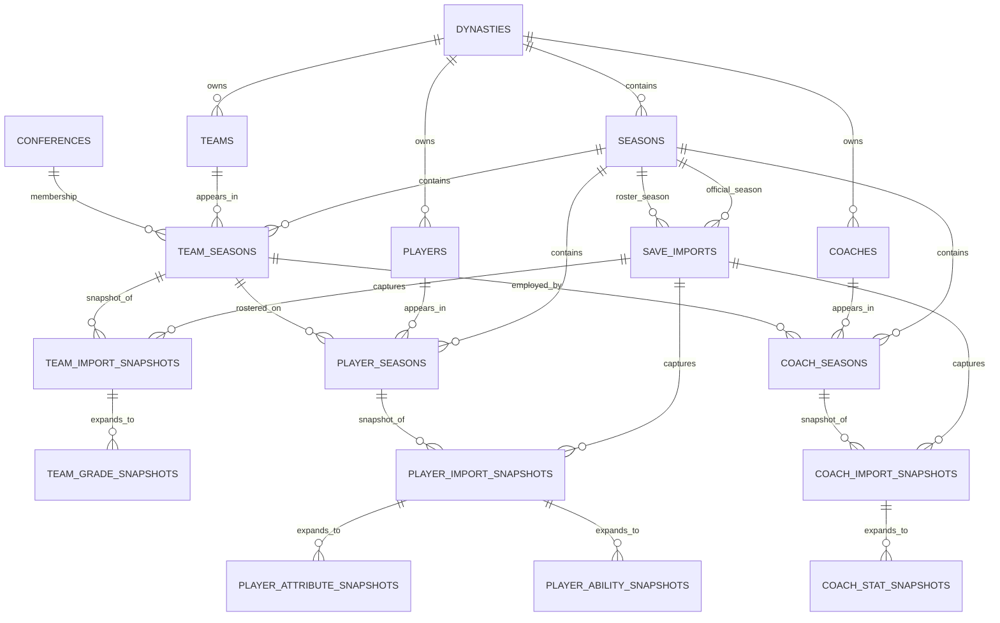

# Field Index PostgreSQL ERD — Pre-Game Storage

This ERD documents the database through the point immediately before game
storage is introduced.



## Entity vs. snapshot

Field Index separates relatively stable identity from values that can change
week to week.

Example:

```text
players
  Nicholas Example (persistent identity)
       |
       +-- player_seasons (2028 roster relationship)
                 |
                 +-- Week 1 import snapshot
                 +-- Week 8 import snapshot
                 +-- postseason import snapshot
```

This prevents an import in Week 10 from erasing what the player's overall,
team, abilities, or appearance looked like in Week 1.

## Multi-dynasty isolation

`teams`, `players`, and `coaches` are scoped to `dynasty_id`. This is deliberate:
custom/Team Builder data can make a raw game index mean different things in two
different dynasties. Field Index does not assume every dynasty shares identical
program/entity state.

## Next ERD expansion

The next migration begins game storage and will connect games to dynasty seasons,
teams, and later player/team game-stat facts. It is intentionally not included
in this pre-game schema.
