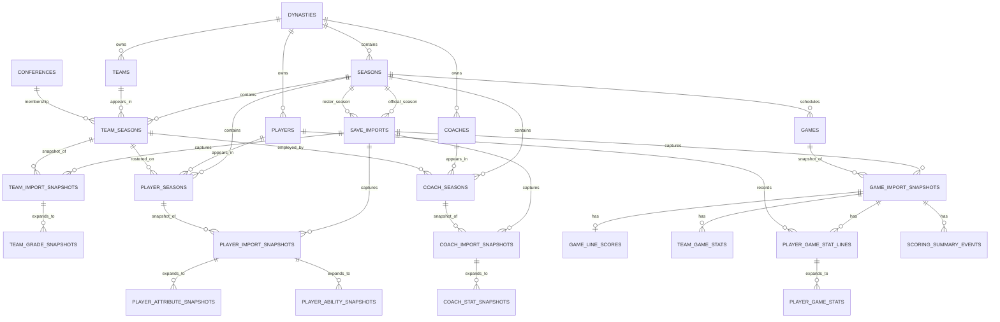

# Field Index PostgreSQL ERD



## Entity vs. snapshot

Field Index separates relatively stable identity from values that change over
time. A player has one persistent dynasty identity, season relationships, and
many import snapshots. The same pattern is used for teams, coaches, and games.

For games, the logical schedule slot is stable while participants/results are
snapshotted because unplayed postseason slots can change:

```text
games
  2028 / BowlSeason1 / Week 17 / Game 3
       |
       +-- earlier import: unplayed matchup
       +-- later import: final participants + score
```

## Multi-dynasty isolation

`teams`, `players`, and `coaches` are scoped to `dynasty_id`. Custom/Team Builder
data can make a raw game index mean different things in two dynasties, so Field
Index does not assume entity identity is globally shared.

## Analytics facts

Several JSON snapshots are retained for fidelity, then expanded into long-form
facts for analysis:

- player attributes
- player abilities
- team grades
- coach stats
- player game stats

This makes common SQL and Power BI filtering/aggregation possible without
requiring JSON extraction in every report.

## Analytics and BI view layer

Migration 006 leaves the normalized/raw tables in `public` and adds two read-only
view schemas:

```text
public normalized storage
   |
   +--> analytics.import_context
   |       |
   |       +--> latest/best import selectors
   |                |
   |                +--> games
   |                +--> team_games
   |                +--> player_games
   |                +--> scoring_events
   |                |
   |                +--> team/player/coach season snapshots
   |                          |
   |                          +--> player_seasons / player_careers
   |                          +--> team offense / defense / rankings
   |                          +--> conference_seasons
   |                          +--> coach_seasons / coach_careers
   |                          +--> transfer/history views
   |
   +--> import-by-import team/player/coach progression

analytics curated views
   |
   +--> bi.dim_* dimensions
   +--> bi.fact_* facts
```

The `analytics` layer resolves which save import should be used for each data
purpose. Schedule/results use the newest season import; roster data uses the
newest import for that roster season; team/player/scoring game facts use the
richest retained checkpoint so later offseason cache clearing does not erase a
completed season from reports.
